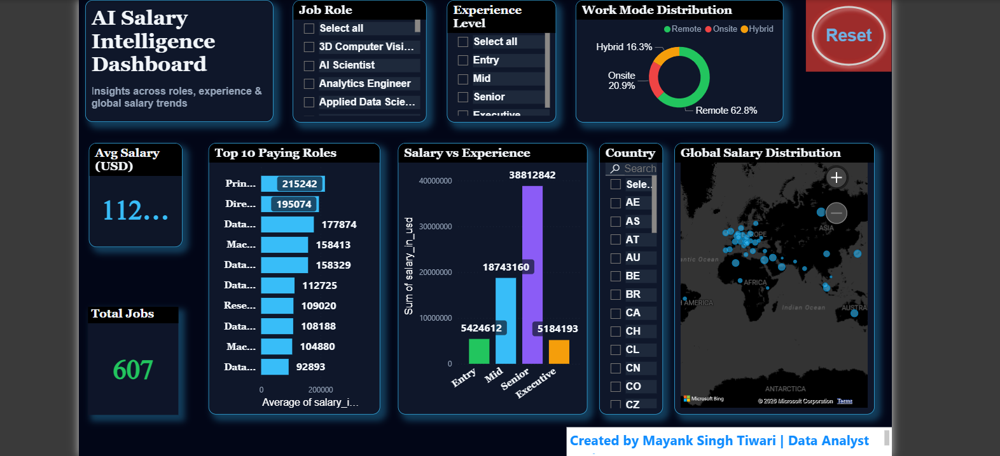

# 📊 AI Salary Intelligence Dashboard

## 🔹 Overview
This project analyzes global salary trends across job roles, experience levels, and locations using SQL and Power BI.

## 🔹 Tools Used
- SQL (CTEs, Joins, Window Functions)
- Power BI (DAX, Dashboard)
- Excel (Data Cleaning)

## 🔹 Key Features
- Salary analysis by role and experience
- Interactive dashboard with filters
- KPI metrics for decision-making

## 🔹 Key Insights
- Senior roles have higher salary variation
- Location impacts salary significantly
- Experience level strongly affects compensation

## 🔹 Files Included
- SQL Queries
- Power BI Dashboard (.pbix)
- Dataset
- Dashboard Screenshot

## 🔹 Dashboard Preview

